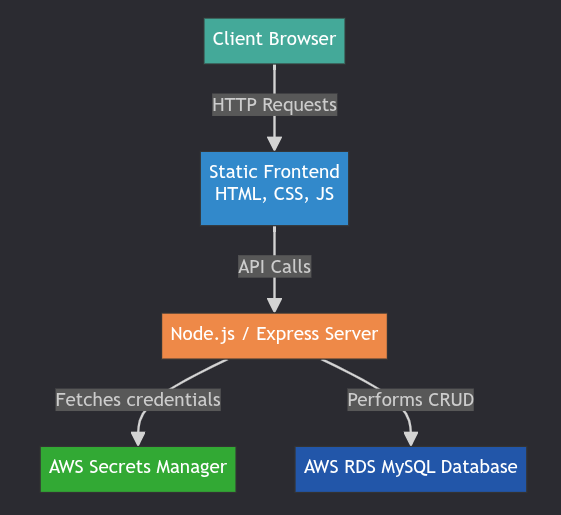

# Patient Management Full-Stack Application

A full-stack application featuring a Node.js/Express.js backend API and a simple static frontend to manage patient records. The application is designed for security and scalability, integrating with AWS RDS for the database and AWS Secrets Manager for credential management.

## Architecture Overview



## Features

- **CRUD Operations:** Create, Read, Update, and Delete patient records.
- **Secure by Design:** Uses AWS Secrets Manager to handle database credentials, avoiding hardcoded secrets.
- **Efficient:** Utilizes a connection pool for efficient database interactions.
- **Self-Healing Schema:** Automatically creates the necessary database table on startup if it doesn't exist.
- **Simple:** A lightweight and straightforward API and UI design.

## Tech Stack

- **Backend:** Node.js, Express.js
- **Frontend:** HTML, Vanilla JavaScript, Bootstrap 5
- **Database:** MySQL (tested with AWS RDS and local Docker instances)
- **Security:** AWS Secrets Manager
- **Deployment:** PM2 (Process Manager)

## Prerequisites

- **Node.js:** `v18.0.0` or higher (required by AWS SDK v3).
- **Docker:** Required for running the local MySQL database script.
- **An AWS account** with:
  - Programmatic access configured (e.g., via `~/.aws/credentials`).
  - An AWS RDS MySQL database (for cloud deployment).
  - An AWS Secrets Manager secret containing the database credentials.

## Setup and Configuration

### 1. Clone the Repository

```bash
git clone <repository-url>
cd ptmngmt-app
```

## Installation

1. Clone the repository:

    ```bash
    git clone <repository-url>
    ```

2. Navigate to the project directory:

    ```bash
    cd ptmngmt-app
    ```

3. Install the dependencies:

    ```bash
    npm install
    ```

## Usage

### Development

To run the server in development mode (with automatic restarts on file changes), use:

```bash
npm run dev
```

### Production

To start the server for production, use:

```bash
npm start
```

The application will be accessible at `http://localhost:5005` (or the port specified in your `.env` file).

## Local Testing with Docker

For local development and testing, you can use the provided `run-mysql-docker.sh` script to easily set up a MySQL database in a Docker container.

### Running the Script

1. Make sure you have Docker installed and running on your system.
2. Make the script executable:

    ```bash
    chmod +x run-mysql-docker.sh
    ```

3. Run the script:

    ```bash
    ./run-mysql-docker.sh
    ```

The script will:

- Pull the `mysql:8` Docker image.
- Create a Docker volume named `mysql-data` to persist your data.
- Start a MySQL container named `mysql-test`.
- Set the root password to `SuperSecret`.

You can then connect to this database using the following command:

```bash
docker exec -it mysql-test mysql -u root -p
```

When prompted, enter the password: `SuperSecret`.

After connecting, you can create the necessary database and tables with these SQL commands:

```sql
CREATE DATABASE patients_db;
USE patients_db;
CREATE TABLE patients (
  id INT AUTO_INCREMENT PRIMARY KEY,
  name VARCHAR(255) NOT NULL,
  patient_number VARCHAR(100) NOT NULL
);
```

Remember to update your `.env` file to connect to this local database:

```bash
DB_HOST=localhost:3306
DB_NAME=patients_db
# You may not need the DB_SECRET_ARN for local testing,
# but you'll need to configure the app to use a direct password.
# For this script, the password is "SuperSecret".
```

## API Endpoints

| Method | Endpoint | Description | Request Body | Response |
|---|---|---|---|---|
| `GET` | `/api/patients` | Get all patients | (none) | `{"patients": [...]}` |
| `POST` | `/api/patients` | Add a new patient | `{"name": "John Doe", "patientNumber": "P12345"}` | `{"id": 1, "name": "John Doe", "patient_number": "P12345"}` |
| `PUT` | `/api/patients/:id` | Update a patient | `{"name": "Jane Doe", "patientNumber": "P54321"}` | `{"message": "Patient updated successfully."}` |
| `DELETE` | `/api/patients/:id` | Delete a patient | (none) | (204 No Content) |
| `GET` | `/health` | Health check | (none) | `{"status": "ok", "service": "patient-management-api"}` |

## Deployment

The `start_app_pm2.sh` script is provided for deploying and managing the application with PM2, a process manager for Node.js applications.

To use it:

1. Ensure the script is executable: `chmod +x start_app_pm2.sh`
2. Run the script: `./start_app_pm2.sh`

This will start the application, configure PM2 to automatically restart it on server reboots, and save the process list.
